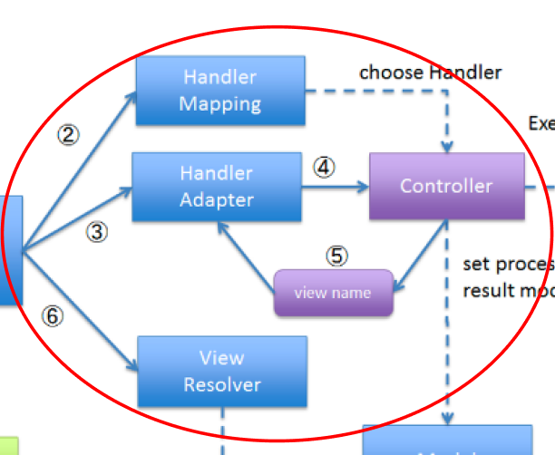

# controller란?
#### Controller는 사용자 요청을 처리하고, 비즈니스 로직을 수행하며, 결과를 View에 전달하는 역할을 함.
### 1. 요청 수신: 
#### 사용자의 HTTP 요청을 받음
### 2. 비즈니스 로직 처리: 
#### 요청에 따라 필요한 기본적인 비즈니스 로직을 수행, 이 과정에서 Service 계층을 호출할 수 있음.
### 3. 모델 업데이트: 
#### 비즈니스 로직의 결과를 Model 객체에 저장.
### 4. 뷰 선택: 
#### 결과를 보여줄 View를 선택하고, Model 데이터를 View에 전달.
#
## 필요 lib
### Spring Web <웹 애플리케이션 개발을 위한 기본적인 기능을 제공하는 라이브러리>
### Spring Boot Starter <Spring Boot 프로젝트 쉽게 설정, 실행을 도와주는 라이브러리>
### Spring Boot Starter Thymeleaf <뷰 렌더링할 때 사용되는 라이브러리>
### Spring Boot Starter Data JPA <DB 상호작용 할 때 필요한 라이브러리>
### Lombok <코드 보일러플레트를 줄여주는 라이브러리, get / setter / toString 등의 메서드 자동 작성>
### Validation <입력 데이터 유효성 검사 라이브러리>

## 아키텍처 이미지

