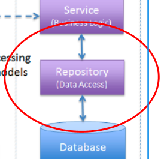

# REPOSITORY 란?
### Repository 계층은 데이터 접근 계층(Data Access Layer)으로, 데이터베이스와 상호작용하여 데이터를 저장, 수정, 검색, 삭제하는 역할을 함
##
### 1. Repository 계층의 역할
#### - 데이터 접근: 데이터베이스와 상호작용하여 데이터를 저장, 수정, 검색, 삭제함.
#### - 데이터 캡슐화: 데이터베이스와의 상호작용을 캡슐화하여 비즈니스 로직에서 데이터 접근 로직을 분리함.
#### - 트랜잭션 관리: 데이터베이스 작업을 트랜잭션 단위로 처리하여 데이터 일관성을 유지함.
##
### 2. Service 계층과의 상호작용
#### - Service 계층은 비즈니스 로직을 처리하기 위해 Repository 계층을 호출함.
##
# 필요한 lib
### Spring Data JPA((Java Persistence API)를 기반으로 하여 데이터 접근 용이함)
### MySQL Connector(JDBC(Java Database Connectivity) 표준을 준수하여, Java 애플리케이션이 MySQL 데이터베이스와 상호작용함.)
##
## 아키텍처

