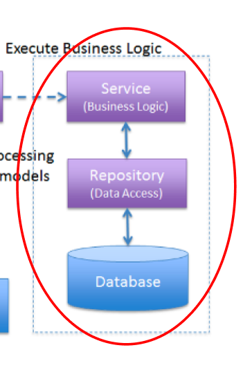

# service 란?
### Service 계층은 비즈니스 로직을 처리하고, Controller와 데이터 접근 계층(Repository) 사이에서 중간 역할을 함.
### 1. 비즈니스 로직 구현: 
#### 데이터 가공, 변환, 검증 등.
### 2. 데이터 접근 계층과의 상호작용: 
#### Repository 계층을 통해 데이터베이스 작업 수행.
### 3. 트랜잭션 관리: 
#### 여러 데이터베이스 작업을 하나의 트랜잭션으로 처리.
### 4. 비즈니스 규칙 적용: 
#### 특정 조건을 만족하는지 확인하고 처리.
### 5. 다른 서비스와의 상호작용: 
#### 외부 API 호출, 내부 서비스 통신 등.

## 아키텍처

