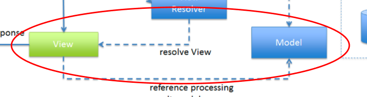

# view 계층
### 사용자 인터페이스(UI)를 담당하며, 사용자에게 데이터를 표시하고 사용자로부터 입력을 받는 역할을 함. 
### 화면을 렌더링하고, 사용자와의 상호작용을 처리함.
##
### View 계층의 역할
#### - 데이터 표시: Model에서 전달받은 데이터를 사용자에게 표시함.
#### - 사용자 입력 처리: 사용자의 입력(예: 버튼 클릭, 폼 제출 등)을 받아 Controller로 전달함.
#### - UI 업데이트: Model의 상태 변화에 따라 UI를 업데이트.
##
## 필요 lib
### 1. Thymeleaf (Spring Boot와 함께 사용되는 템플릿 엔진으로, HTML 파일을 동적으로 생성할 수 있음.)
### 2. Spring Boot Starter Web (Spring MVC를 사용하여 웹 애플리케이션을 개발하기 위한 기본적인 라이브러리임.)

## 아키텍처 
